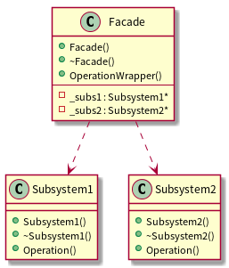

[返回](../../README.md)

# Facade外观模式

> 举一个生活中的小例子,大凡开过学或者毕过业的都会体会到这样一种郁闷:你要去 n
个地方办理 n 个手续(现在大学合并后就更加麻烦,因为可能那 n 个地方都隔的比较远)。
但是实际上我们需要的就是一个最后一道手续的证明而已,对于前面的手续是怎么办的、到
什么地方去办理我们都不感兴趣。
实际上在软件系统开发中也经常回会遇到这样的情况,可能你实现了一些接口(模块),
而这些接口(模块)都分布在几个类中(比如 A 和 B、C、D):A 中实现了一些接口,B 中
实现一些接口(或者 A 代表一个独立模块,B、C、D 代表另一些独立模块)。然后你的客户
程序员(使用你设计的开发人员)只有很少的要知道你的不同接口到底是在那个类中实现的,
绝大多数只是想简单的组合你的 A-D 的类的接口,他并不想知道这些接口在哪里实现的。
这里的客户程序员就是上面生活中想办理手续的郁闷的人!在现实生活中我们可能可以
很快想到找一个人代理所有的事情就可以解决你的问题(你只要维护和他的简单的一个接口
而已了!),在软件系统设计开发中我们可以通过一个叫做 Façade 的模式来解决上面的问题。

