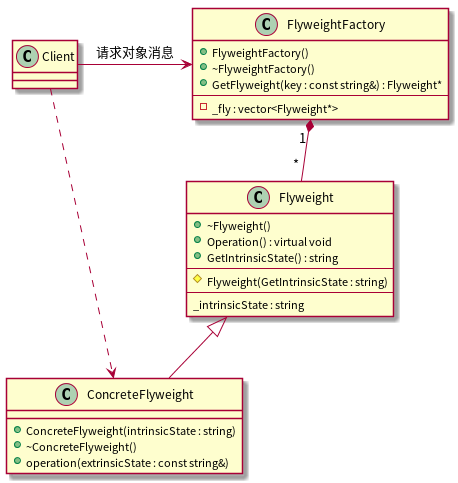

[返回](../../README.md)

# Flyweight享元模式

> 在面向对象系统的设计和实现中，创建对象是最常见的操作。这里就有一个问题：如果一个应用程序使用了太多的对象，就会造成很大的存储开销。特别是对于大量轻量级(细粒度)的对象，比如在文档编辑器的设计过程中，我们如果每个字母创建一个对象的话，系统可能会因为大量的对象而造成存储开销的浪费。例如一个字母"a"在文档中出现了10000次，而实际上我们可以让这一万个字母"a"共享一个对象，当然因为在不同的位置可能字母"a"有不同的显示效果(例如字体和大小等设置不同)，在这种情况我们可以为将对象的状态分为"外部状态"和"内部状态"，将可以被共享(不会变化)的状态作为内部状态存储在对象中，而外部对象(例如上面提到的字体，大小等)我们可以在适当的时候将外部对象最为参数传递给对象(例如在显示的时候，将字体，大小等信息传递给对象)

