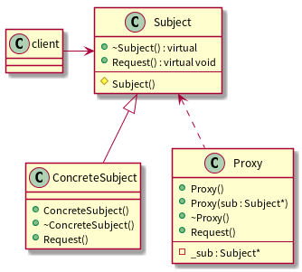

[返回](../../README.md)

# Proxy代理模式

> 创建开销大的对象时候，比如显示一幅大的图片，我们将这个创建的过程交给代理去完成，GoF称之为虚代理。

> 为网络上的对象创建一个局部的本地代理，比如要操作一个网络上的一个对象(网络性能不好的时候，问题尤其突出)，我们将这个操纵的过程交给一个代理去完成，GoF称之为远程代理(Remote Proxy)

> 对对象进行控制访问的时候，比如在Jive论坛中不同权限的用户(如管理员，普通用户等)将获得不同层次的操作权限，我们将这个工作交给一个代理去完成，GoF称之为保护代理(Protection Proxy)

